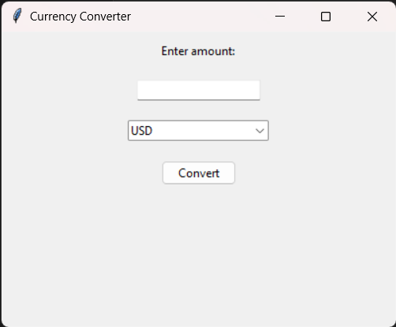
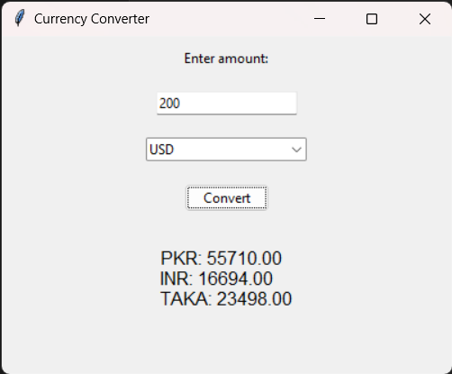

# Currency Converter

This is a simple currency converter application developed using Python and Tkinter. The application allows users to convert amounts between different currencies based on predefined exchange rates.

## Features

- Convert between USD, PKR, INR, and TAKA.
- Simple and intuitive GUI built with Tkinter.
- Easy to use: just enter the amount, select the currency, and click convert.

## GUI Preview:



## Conversion Rates

The application uses the following predefined exchange rates:

- 1 USD = 278.55 PKR
- 1 USD = 83.47 INR
- 1 USD = 117.49 TAKA
- 1 INR = 3.34 PKR
- 1 TAKA = 2.37 PKR
- 1 INR = 1.41 TAKA

## Requirements

- Python 3.x
- Tkinter (included with most Python installations)

## Installation

1. Clone the repository or download the source code.
    ```sh
    git clone https://github.com/shabanazfar/currency-converter.git
    ```
2. Navigate to the project directory.
    ```sh
    cd currency-converter
    ```

## Usage

1. Run the `currency_converter.py` script.
    ```sh
    python currency_converter.py
    ```
2. The GUI will open. Enter the amount you want to convert.
3. Select the currency of the entered amount from the dropdown menu.
4. Click the "Convert" button to see the converted amounts in other currencies.

## Example Code

Here is an example of the currency conversion logic implemented in the application:

```python
def currency_converter():
    amount = float(amount_entry.get())
    currency = currency_var.get()

    if currency == "USD":
        pkr = amount * USD_to_PKR
        inr = amount * USD_to_INR
        taka = amount * USD_to_TAKA
        result_var.set(f"PKR: {pkr:.2f}\nINR: {inr:.2f}\nTAKA: {taka:.2f}")
    elif currency == "PKR":
        usd = amount / USD_to_PKR
        inr = amount / INR_to_PKR
        taka = amount / TAKA_to_PKR
        result_var.set(f"USD: {usd:.2f}\nINR: {inr:.2f}\nTAKA: {taka:.2f}")
    elif currency == "INR":
        usd = amount / USD_to_INR
        pkr = amount * INR_to_PKR
        taka = amount * INR_to_TAKA
        result_var.set(f"USD: {usd:.2f}\nPKR: {pkr:.2f}\nTAKA: {taka:.2f}")
    elif currency == "TAKA":
        usd = amount / USD_to_TAKA
        pkr = amount * TAKA_to_PKR
        inr = amount / INR_to_TAKA
        result_var.set(f"USD: {usd:.2f}\nPKR: {pkr:.2f}\nINR: {inr:.2f}")
```

## License

This project is licensed under the Apache 2.0 License. See the [LICENSE](LICENSE) file for details.

## Contributing

Contributions are welcome! Please open an issue or submit a pull request for any improvements or bug fixes.
